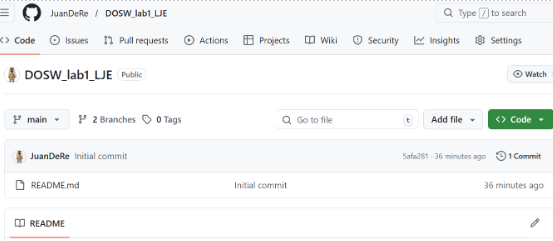
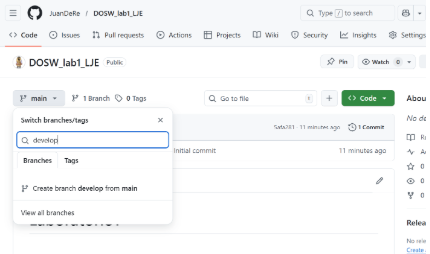
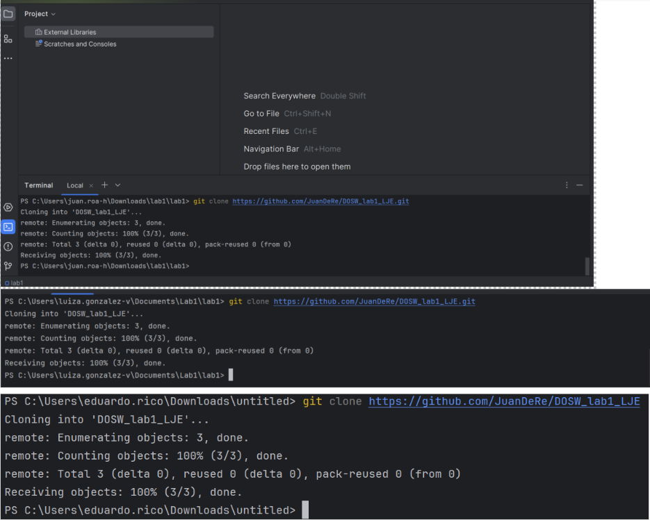
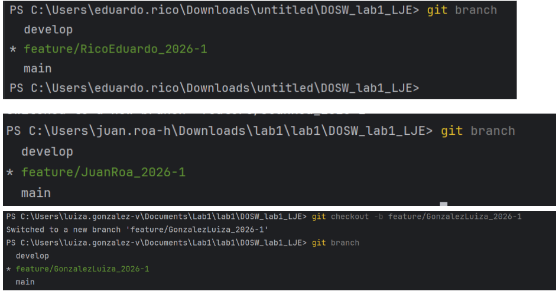
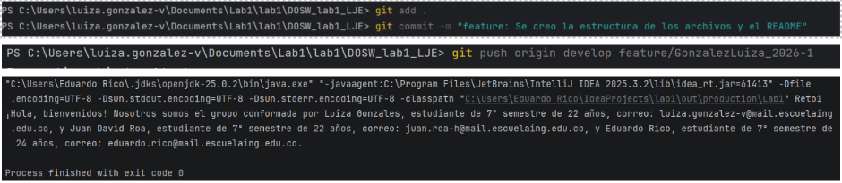
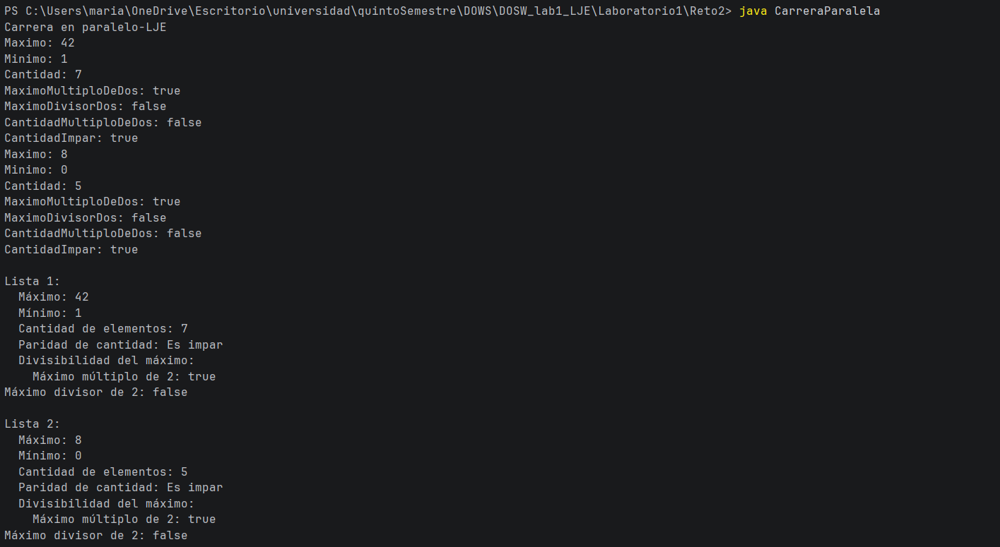
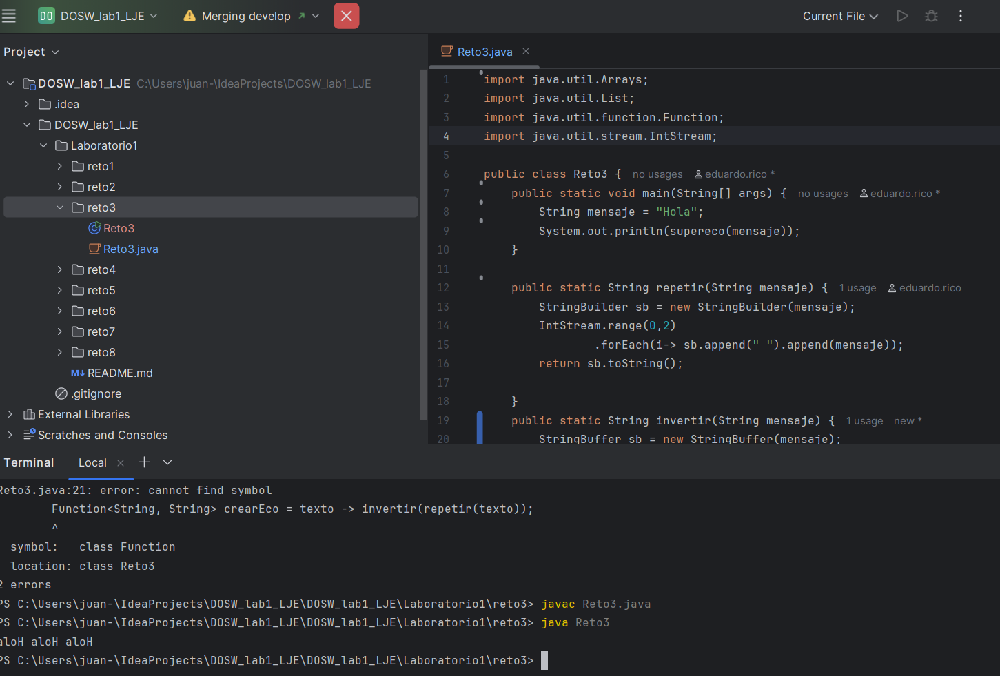
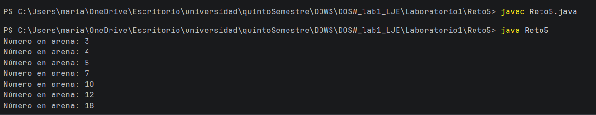
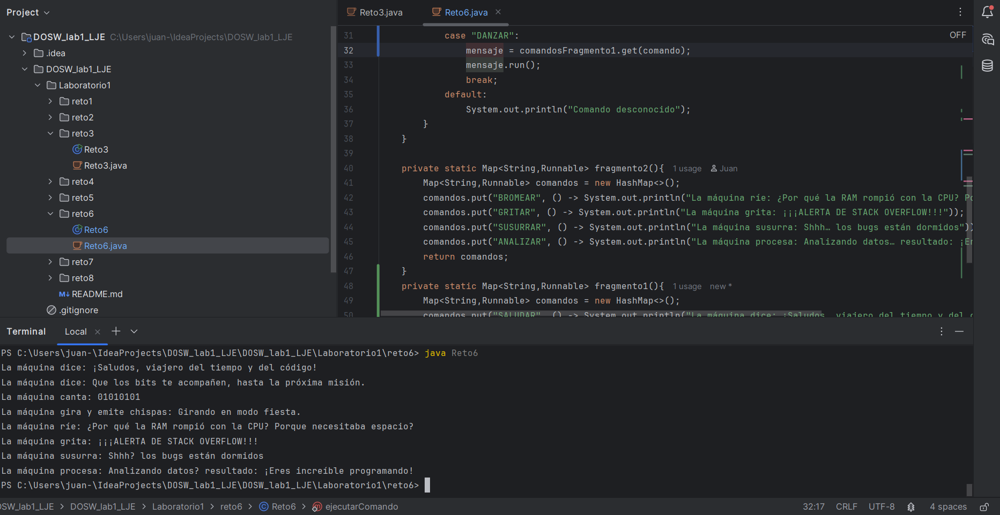

# LABORATORIO 1: INTRODUCCIÓN A GIT Y PROGRAMACIÓN FUNCIONAL

Escuela Colombiana de Ingeniería Julio Garavito – DOSW

### Nombres: 
- Juan David Roa
- Luiza González
- Eduardo Rico

### OBJETIVO:

En el presente laboratorio vamos a aprender los manejos básicos de GitHub junto a los principios de la programación funcional y el manejo de algunas estructuras de datos. Esto con el propósito de apropiar y comenzar a trabajar con las fundamentaciones del curso. Para este laboratorio se trabajará de a parejas, pero cada uno trabajará en su computador.

## PARTE 1 – ONBOARDING

1. Hoja de vida

####   Juan David Roa

1. Nombre por el cual les gusta ser llamados (o alias)
   -Juan David

2. Semestre
 -7mo

3. Lenguajes de programación que conocen.
-Python, Java, MySQL, Bash, Marie, C

4. Frameworks o tecnologías que conocen.
-Ninguno

5. Proyectos personales o académicos (si tienen).
-aprender a tocar bien guitarra y aprender alemán

6. ¿Pertenecen a algún semillero? ¿A cuál?
-no

7. Hobbies o intereses fuera de la Escuela. 
-guitarra, ir al gimnasio, videojuegos, los idiomas, los carros

8. ¿Qué les gustaría aprender?
-Organizar un trabajo en equipo de una manera de la manera mas eficiente y como trabajar así.
Tecnologias y estrategias que se usen realmente en el mundo laboral

9. ¿En qué se sienten más inseguros o les cuesta un poco más frente a los temas de la materia?
-Interfaces y herencias (Cuando conviene mas qué) y frontend    

#### Luiza Gonzalez
1. Nombre por el cual les gusta ser llamados (o alias).
   -Luiza
2. Semestre.
   -Sexto semestre
3. Lenguajes de programación que conocen.
   -Python, Java,MySQL
4. Frameworks o tecnologías que conocen.
   -Ninguna
5. Proyectos personales o académicos (si tienen).
   -Manejar Italiano e Ingles.
6. ¿Pertenecen a algún semillero? ¿A cuál?
   -No pertenezco a ningún semillero
7. Hobbies o intereses fuera de la Escuela.
   -Ver series o películas y dibujar.
8. ¿Qué les gustaría aprender?
   -Me gustaría aprender a trabajar en equipo y front.
9. ¿En qué se sienten más inseguros o les cuesta un poco más frente a los temas de la materia?
-la parte de integrar front con back
    
#### Eduardo Rico
1. Nombre por el cual les gusta ser llamados (o alias)
-Rico
2. Semestre
-7
3. Lenguajes de programación que conocen.
-Python, Java, SQL
4. Frameworks o tecnologías que conocen.
-Ninguno
5. Proyectos personales o académicos (si tienen).
Tener el mayor crecimiento personal e intelectual posible aprendiendo cada día algo nuevo
6. ¿Pertenecen a algún semillero? ¿A cuál?
-no
7. Hobbies o intereses fuera de la Escuela.
-gimnasio, futbol, running en general deporte
8. ¿Qué les gustaría aprender?
-Perdón por mi respuesta cliché, pero todo lo que más se pueda, mi objetivo es absorber el mayor conocimiento posible
9. ¿En qué se sienten más inseguros o les cuesta un poco más frente a los temas de la materia?
-En ocasiones anteriores he tenido muchas dificultades con mis compañeros de grupo lo que ha generado en mí que me cueste más trabajar en equipo, en cuanto a los temas de la materia pues me dejaré sorprender jeje

### Horarios Disponibles:

Luiza: Sábados PM, Domingo, Entre semana después de las 7PM

Rico: sábado, Domingo, martes y jueves tarde

Juan David: lunes, martes, sábados tarde, Domingo depende.

### Compromisos:

-Responsabilidad

-Comprometerse a dar una Buena explicación de las ideas

-Una buena comunicación al desarrollar cada parte individualmente para que en conjunto tengamos un conocimiento general del Proyecto

-Estar dispuesto a apoyar al compañero

-Comunicación asertiva

### Usuarios Github:

Juan David: JuanDeRe
Luiza Gonzales: LuizaGonzalez
Eduardo Rico: EduardoRico26

## PARTE 2 - Preparación

Creación del repositorio y adición de los miembros

Creación de la rama develop desde el github

Descargue el repositorio en su local con git clone url_del_repositorio.

Una vez descargado, cada integrante debe crear una rama con el comando git checkout -b nombre_de_la_rama, partiendo desde develop con el formato: feature/ApellidoNombre_2026-1.

Un integrante de la pareja dentro de su rama generará una carpeta con la siguiente estructura de paquetes:

## Retos completados

### Reto 1: La Bienvenida

**Reto Desarrollado por:**
- Luiza Mariana González Veloza
- Eduardo Rico Duarte
  
**Evidencia:**
  

Captura de imagen

**Descripción:**
En este reto se modelaron objetos Estudiante con información personal (nombre, edad, correo y semestre), los cuales se almacenaron en una lista. Usando expresiones lambda y streams, se transformaron y recopilaron los datos para construir un mensaje de bienvenida completo. 

### Reto 2: Carrera en Paralelo

**Reto Desarrollado por:**
- Luiza Mariana González Veloza
- Juan David Roa Hernández

**Evidencia:**

Captura de imagen

**Descripción:**

Este reto simuló una carrera usando ramas de Git donde cada estudiante desarrolló funciones distintas en paralelo.

### Reto 3:  El eco misterioso

**Reto Desarrollado por:**
- Eduardo Rico Duarte
- Juan David Roa Hernández 

**Evidencia:**

Captura de imagen

**Descripción:**

Cada estudiante trabajó su rama cada uno con una función diferente:  StringBuilder y StringBuffer. Donde se implementaba una transformación diferente del mensaje y luego se enfrentó un conflicto al combinar ambas lógicas.

### Reto 4:  El tesoro de las llaves duplicadas

**Reto Desarrollado por:**
- Eduardo Rico Duarte
- Luiza Mariana González Veloza

**Evidencia:**

Captura de imagen

**Descripción:**

Este reto se centró en el uso de HashMap y Hashtable para manejar claves duplicadas y sincronización. Cada estudiante implementó su versión y luego se combinaron los mapas priorizando los valores correctos.

### Reto 5: Batalla de Conjuntos

**Reto Desarrollado por:**
- Juan David Roa Hernández
- Luiza Mariana González Veloza

**Evidencia:**

Captura de imagen

**Descripción:**

En este reto se trabajó con colecciones HashSet y TreeSet para almacenar números sin duplicados, aplicar filtros y mantener orden. Cada estudiante eliminó ciertos múltiplos y luego se unificaron los conjuntos en una estructura ordenada. 

### Reto 6: La máquina de decisiones

**Reto Desarrollado por:**
- Eduardo Rico Duarte
- Juan David Roa Hernández

**Evidencia:**

Captura de imagen

**Descripción:**

En este reto se implementó una máquina que responde a comandos usando switch-case y un Map<String, Runnable> con lambdas. Cada estudiante desarrolló un conjunto de comandos distinto y luego se unificaron en una sola lógica.

## Preguntas teóricas

1. ¿Cuál es la diferencia entre git merge y git rebase?
R/ La diferencia principal es que git merge une dos ramas creando un commit adicional que combina sus historias, manteniendo el historial completo tal como ocurrió. En cambio, git rebase mueve los commits de una rama para colocarlos encima de otra, reescribiendo la historia y dejándola lineal.

2. Si dos ramas modifican la misma línea de un archivo, ¿qué sucede al hacer merge?
R/ Lo que sucede es un conflicto de fusión. Git detiene el merge porque no puede decidir qué cambio es el correcto. Entonces se debe escoger manualmente qué versión conservar, guardar los cambios con git add, git commit, git push  y luego completar el merge.

3. ¿Cómo puedes ver gráficamente el historial de merges y ramas en consola?
R/ Para ver el historial de una forma más visual en la terminal de usa el comando: git log --graph --oneline --decorate --all. Este comando muestra un pequeño diagrama donde puedes identificar ramas y merges, como se puede evidenciar en la imagen siguiente.

4. Explica la diferencia entre un commit y un push.
Un commit guarda los cambios en el repositorio local, es decir, solo en la computadora en la que se está trabajando. Un push, por otro lado, envía esos commits al repositorio remoto en nuestro caso a Git Hub . Básicamente: commit = local, push = compartirlo con los demás.

5. ¿Para qué sirven git stash y git pop?
El comando git stash sirve para guardar temporalmente cambios que aún no quieres comprometer y necesitas apartar para cambiar de rama sin perder nada. Luego, cuando quieres recuperar ese trabajo, usas git pop para volver a aplicar los cambios guardados en tu directorio de trabajo.

6. ¿Qué diferencia hay entre HashMap y HashTable?
La diferencia principal es que HashMap no es sincronizado, lo que lo hace más rápido y permite claves o valores nulos. En cambio, HashTable sí es sincronizado, por lo que es seguro para entornos con múltiples hilos, lo cual lo lleva a hacer lento. Además, HashTable no permite valores null.

7. ¿Qué ventajas tiene Collectors.toMap() frente a un bucle tradicional para llenar un mapa?
Collectors.toMap() nos permite tener código más consiso, reduciendo líneas de código y haciéndolo más fácil de leer. Además, facilita transformar claves, valores o resolver colisiones sin necesidad de escribir estructuras repetitivas como un for manual.

8. Si usas List con objetos y luego aplicas stream().map(), ¿qué tipo de operación estás haciendo?
Estás realizando una operación de transformación, porque map() toma cada elemento de la lista original y lo convierte en otro tipo de dato u objeto. El resultado es un Stream con los elementos ya transformados.

9. ¿Qué hace el método stream().filter() y qué retorna?
filter() evalúa una condición lógica y solo permite pasar a los elementos que la cumplen. Lo que retorna es un Stream filtrado, que contiene únicamente los elementos que pasaron la condición.

10. Describe el paso a paso de cómo crear una rama desde develop si es una funcionalidad nueva.
•	Verificamos que estamos en la rama de develop 
•	Luego utilizamos el comando que crea una rama git checkout -b nombre rama
Este comando como ya se va a mencionar en la siguiente pregunta te mueve directamente a esa rama, en caso de no querer realizarlo asi, utilizar el comando git branch.

11. ¿Cuál es la diferencia entre crear una rama con git branch y con git checkout -b?
El comando git branch nombre solo crea la rama y te mantiene en la misma rama donde estabas. En cambio, git checkout -b nombre crea la rama y además nos redirige a ella automáticamente, lo cual es más práctico cuando se está trabajando.

12. ¿Por qué es recomendable crear ramas feature/ para nuevas funcionalidades en lugar de trabajar en main directamente?
Porque trabajar en una rama feature permite mantener main siempre estable y funcional, sin riesgos de romperla con cambios en desarrollo. También facilita el trabajo en equipo, ya que cada funcionalidad se desarrolla aislada, y además permite hacer revisiones más organizadas mediante pull requests antes de integrar algo en el código principal.

# OBSERVACIONES - GENERALES

## OBSERVACIONES - ONBOARDING (INDIVIDUAL)

## NOTA

 

 

