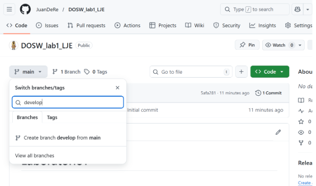

# Maratón Git 2026-1

## Integrantes

Juan David Roa Hernández 
Luiza Mariana González Veloza
Eduardo Rico Duarte

## Retos completados

### Reto 1: Configuración y creación de rama

**Evidencia:**

Captura de imagen

**Descripción:**

### Reto 2: Commit colaborativo

**Evidencia:**

Captura de imagen

**Descripción:**

Breve explicación de cómo se realizó el trabajo colaborativo, cómo se integraron los camb

## Preguntas teóricas

Pregunta 1:

Respuesta...